# Makeコマンド　セットアップ

## 1. インストーラーをダウンロード  
http://gnuwin32.sourceforge.net/packages/make.htm

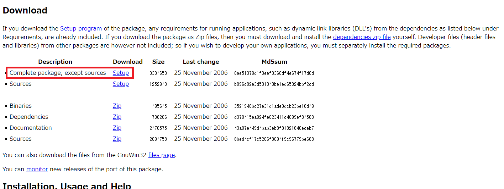 

## 2. ダウンロードした実行ファイルを実行
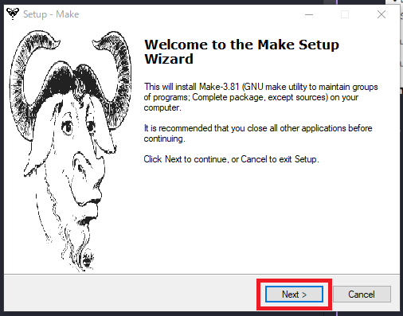
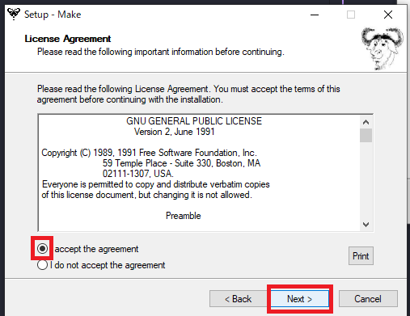 
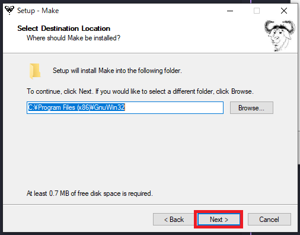 
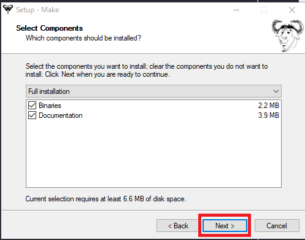 
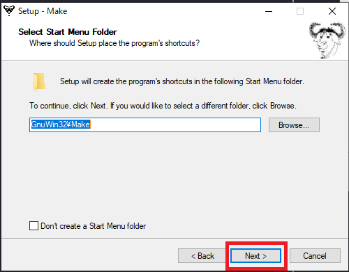 
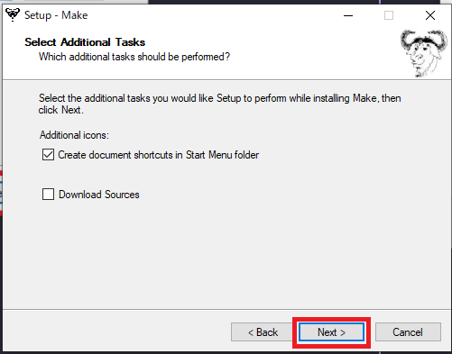 
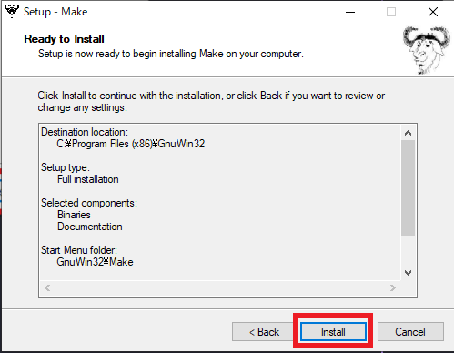 
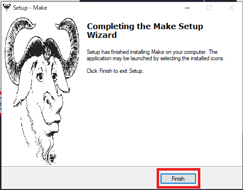 

## 3. Makeのパスを設定

コントロールパネル → システムとセキュリティ → システム → システムの詳細設定 → 環境変数

1. 「環境変数」と検索し、「システム環境変数」の編集を選択  
※「環境変数を編集」ではない   
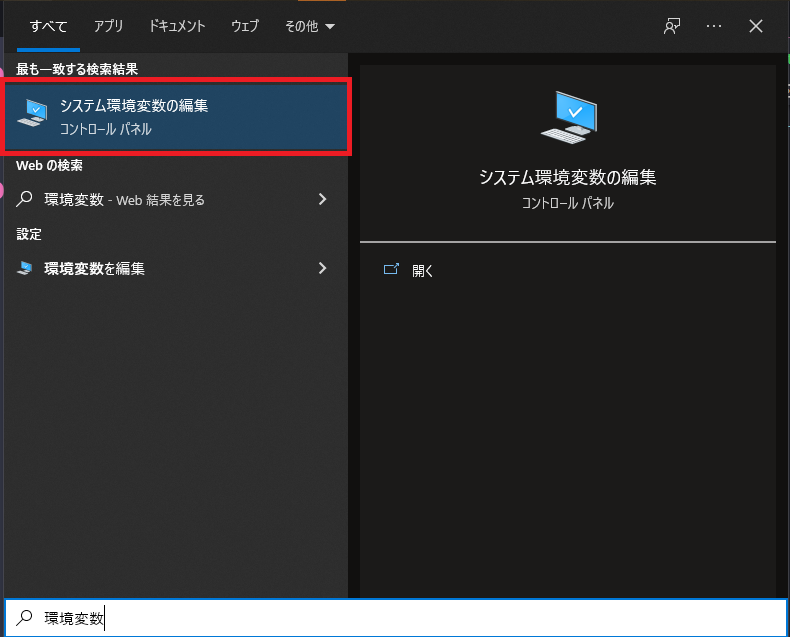 
2. 環境変数を選択  
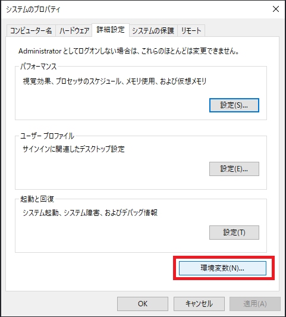 
3. 「システム環境変数」の枠の中にある「Path」を選択し「編集」をクリック  
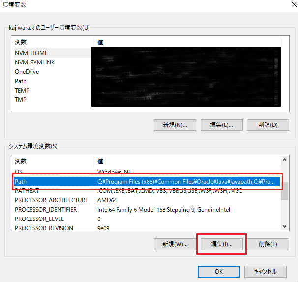 
4. 「新規」→「C:\Program Files (x86)\GnuWin32\bin」→「OK」  
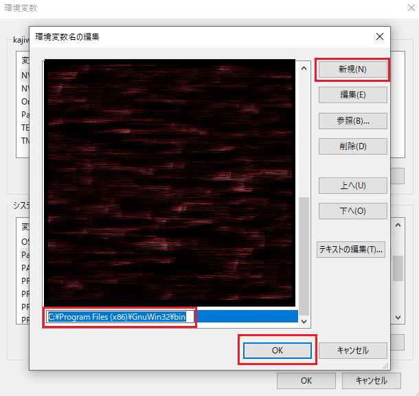 

5. のこりすもすべてOKをクリック
7. VSCode上の左の拡張機能アイコンから、「Makefile Tools」をインストール。  
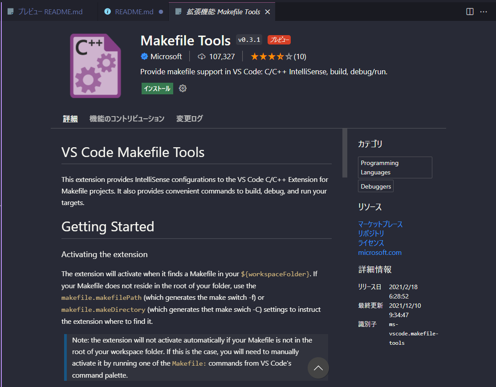 
8. 「control + J」でターミナルを開き、```make --version```と打ち、バージョンが表示されたら問題なくインストールできました。